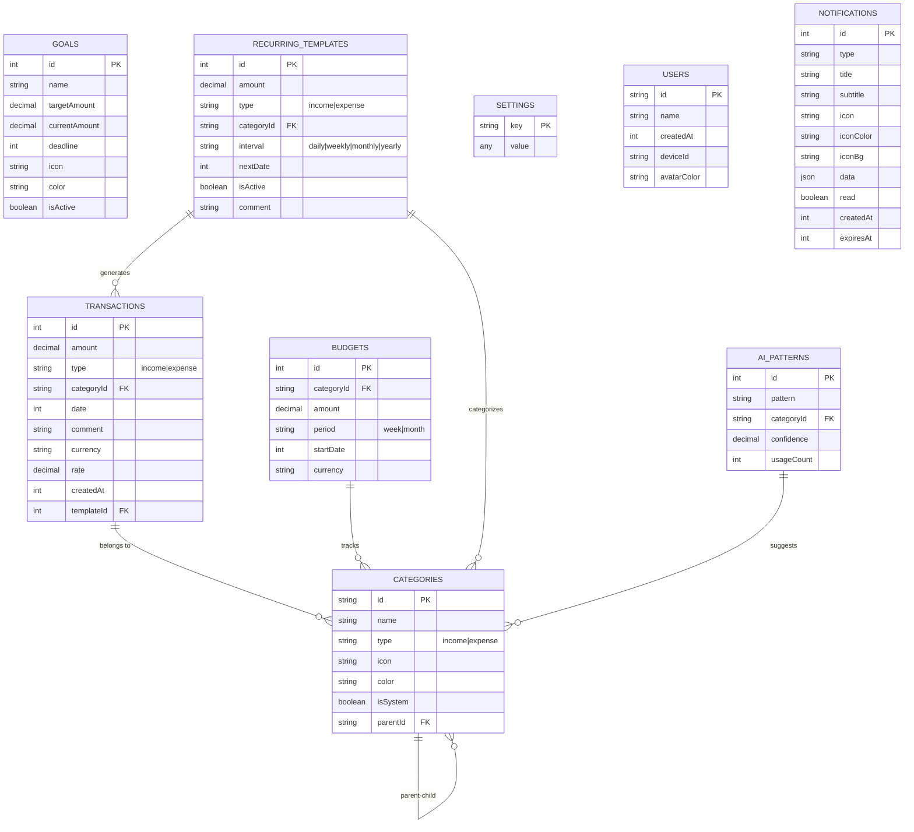

# Database Schema

Database architecture for Finly PWA application.

## ER Diagram



## Tables Description

| Table | Primary Key | Индексы | Описание |
|-------|-------------|---------|----------|
| `transactions` | `++id` (auto-increment) | `date, categoryId, type, createdAt` | Финансовые операции (доходы/расходы) |
| `categories` | `id` (UUID string) | `type, isSystem` | Категории с иконками Lucide и цветами |
| `budgets` | `++id` (auto-increment) | `categoryId, period, startDate` | Лимиты по категориям на период |
| `goals` | `++id` (auto-increment) | `isActive, deadline` | Финансовые цели / накопления |
| `recurringTemplates` | `++id` (auto-increment) | `nextDate, isActive` | Шаблоны повторяющихся платежей |
| `settings` | `key` (string) | — | KV-хранилище настроек приложения |
| `aiPatterns` | `++id` (auto-increment) | `pattern, categoryId` | Паттерны для AI авто-категоризации |
| `users` | `id` (UUID string) | `createdAt` | Профиль пользователя |
| `notifications` | `++id` (auto-increment) | `type, read, createdAt, expiresAt` | Уведомления с persist и статусом прочтения |

## Relationships

- **Transactions → Categories**: Many-to-one (каждая транзакция принадлежит категории)
- **Budgets → Categories**: Many-to-one (бюджеты отслеживают лимиты по категориям)
- **Recurring Templates → Categories**: Many-to-one (шаблоны определяют категорию для платежей)
- **AI Patterns → Categories**: Many-to-one (паттерны предлагают категории)
- **Categories → Categories**: Self-referencing (поддержка подкатегорий через `parentId`)
- **Recurring Templates → Transactions**: One-to-many (шаблоны генерируют транзакции)

---

## Data Models

### Transaction

Финансовая операция (доход или расход).

```typescript
interface Transaction {
  id?: number;          // autoIncrement
  amount: number;
  type: 'income' | 'expense';
  categoryId?: string;  // FK → categories.id (опционально, fallback на системную категорию "Другое")
  date: number;         // timestamp
  comment?: string;
  currency: string;     // код валюты (RUB, USD)
  rate: number;         // курс к базовой валюте
  createdAt: number;    // timestamp создания
  templateId?: number;  // FK → recurringTemplates.id (опционально)
}
```

**Индексы:**
- `date` — фильтрация по дате
- `categoryId` — поиск по категории
- `type` — фильтр доходы/расходы
- `createdAt` — сортировка по времени создания

---

### Category

Категория для классификации операций.

```typescript
interface Category {
  id: string;           // UUID
  name: string;
  type: 'income' | 'expense';
  icon: string;         // название иконки Lucide (Utensils, Car, Home...)
  color: string;        // hex code (#FF5722)
  isSystem: boolean;    // системные категории нельзя удалить
  parentId?: string;    // FK → categories.id (для подкатегорий)
}
```

**Стартовые категории:**

| ID | Название | Тип | Иконка | Цвет |
|----|----------|-----|--------|------|
| `cat_food` | Еда | expense | Utensils | #FF5722 |
| `cat_groceries` | Продукты | expense | ShoppingBasket | #8BC34A |
| `cat_transport` | Транспорт | expense | Car | #2196F3 |
| `cat_home` | Аренда | expense | Home | #795548 |
| `cat_utilities` | Коммунальные | expense | Zap | #FF9800 |
| `cat_health` | Здоровье | expense | Heart | #E91E63 |
| `cat_shopping` | Шопинг | expense | ShoppingBag | #9C27B0 |
| `cat_fun` | Развлечения | expense | PartyPopper | #AB47BC |
| `cat_other_expense` | Другое | expense | CircleHelp | #9E9E9E |
| `inc_salary` | Зарплата | income | Wallet | #4CAF50 |
| `inc_investments` | Инвестиции | income | TrendingUp | #00BCD4 |
| `inc_gift` | Подарок | income | Gift | #9C27B0 |
| `inc_other` | Другое | income | CircleHelp | #9E9E9E |

---

### Budget

Лимит расходов по категории на период.

```typescript
interface Budget {
  id?: number;
  categoryId: string;   // FK → categories.id
  amount: number;
  period: 'week' | 'month';
  startDate: number;    // timestamp начала периода
  currency: string;
}
```

---

### Goal

Финансовая цель с целевой суммой.

```typescript
interface Goal {
  id?: number;
  name: string;
  targetAmount: number;
  currentAmount: number;
  deadline?: number;    // timestamp (опционально)
  icon: string;
  color: string;
  isActive: boolean;
}
```

---

### RecurringTemplate

Шаблон для автоматического создания транзакций.

```typescript
interface RecurringTemplate {
  id?: number;
  amount: number;
  type: 'income' | 'expense';
  categoryId: string;   // FK → categories.id
  interval: 'daily' | 'weekly' | 'monthly' | 'yearly';
  nextDate: number;     // timestamp следующего платежа
  isActive: boolean;
  comment?: string;
}
```

---

### AppSettings

KV-хранилище настроек приложения.

```typescript
interface AppSettings {
  key: string;          // primary key
  value: any;
}
```

**Стандартные настройки:**

| Key | Value | Описание |
|-----|-------|----------|
| `theme` | `'light' \| 'dark' \| 'system'` | Тема оформления |
| `baseCurrency` | `'RUB'` | Базовая валюта |
| `onboardingComplete` | `false` | Пройден ли онбординг |
| `biometric_enabled` | `boolean` | Включена ли биометрическая аутентификация |
| `biometric_credential_id` | `string \| null` | ID WebAuthn credential |
| `biometric_last_active` | `number \| null` | Timestamp последней успешной биометрии |

---

### AIPattern

Паттерн для авто-категоризации операций.

```typescript
interface AIPattern {
  id?: number;
  pattern: string;      // ключевое слово (например, "старбакс")
  categoryId: string;   // FK → categories.id
  confidence: number;   // уверенность модели (0-1)
  usageCount: number;   // сколько раз сработало
}
```

---

### User

Профиль пользователя.

```typescript
interface User {
  id: string;           // UUID
  name: string;
  createdAt: number;    // timestamp
  deviceId?: string;    // navigator.userAgent
  avatarColor?: string; // цвет аватара
}
```

---

### NotificationItem

Уведомление с persist и статусом прочтения.

```typescript
type NotificationType =
  | 'budget-overrun'      // Бюджет превышен
  | 'budget-warning'      // Бюджет почти исчерпан (80%+)
  | 'goal-done'           // Цель достигнута
  | 'goal-near'           // Почти у цели (80%+)
  | 'goal-deadline'       // Дедлайн цели приближается/прошёл
  | 'recurring-due'       // Повторяющийся платёж сегодня
  | 'recurring-upcoming'  // Предстоящий платёж (1-3 дня)
  | 'anomalous-expense'   // Аномально крупная трата
  | 'duplicate-transaction'; // Возможный дубликат

interface NotificationItem {
  id?: number;
  type: NotificationType;
  title: string;          // заголовок уведомления
  subtitle: string;       // подробное описание
  icon: string;           // название Lucide иконки
  iconColor: string;      // цвет иконки (tailwind class)
  iconBg: string;         // цвет фона бейджа (tailwind class)
  data?: Record<string, any>; // доп. данные (categoryId, goalId и т.д.)
  read: boolean;          // статус прочтения
  createdAt: number;      // timestamp создания
  expiresAt?: number;     // опционально: timestamp авто-удаления
}
```

**Индексы:**
- `type` — фильтрация по типу
- `read` — фильтр прочитанных/непрочитанных
- `createdAt` — сортировка по времени
- `expiresAt` — авто-удаление просроченных

---

## Database Versioning

```typescript
// src/db/db.ts
this.version(1).stores({
  transactions: '++id, date, categoryId, type, createdAt',
  categories: 'id, type, isSystem',
  budgets: '++id, categoryId, period, startDate',
  goals: '++id, isActive, deadline',
  recurringTemplates: '++id, nextDate, isActive',
  settings: 'key',
  aiPatterns: '++id, pattern, categoryId',
});

this.version(2).stores({
  ...BASE_SCHEMA,
  users: 'id, createdAt',
});

this.version(3).stores({
  ...BASE_SCHEMA,
  users: 'id, createdAt',
  notifications: '++id, type, read, createdAt, expiresAt',
});
```

---

## Usage Examples

### CRUD Operations

```typescript
import { db } from './db';

// Добавить транзакцию
await db.transactions.add({
  amount: 500,
  type: 'expense',
  categoryId: 'cat_food',
  date: Date.now(),
  comment: 'Обед в кафе',
  currency: 'RUB',
  rate: 1,
  createdAt: Date.now(),
});

// Получить все расходы за категорию
const expenses = await db.transactions
  .where('categoryId')
  .equals('cat_food')
  .and(t => t.type === 'expense')
  .toArray();

// Обновить настройку
await db.settings.put({ key: 'theme', value: 'dark' });

// Получить текущего пользователя
const user = await db.users.get('user-uuid');
```

### Seed Database

```typescript
import { seedDatabase } from './seed';

// Заполняет БД стартовыми данными при первом запуске
await seedDatabase();
```

---

## Files

### Core Files

| File | Description |
|------|-------------|
| `types.ts` | TypeScript-интерфейсы для всех сущностей |
| `db.ts` | Класс Dexie и объявление схем таблиц (singleton) |
| `seed.ts` | Начальное заполнение БД (категории, настройки) |
| `validators.ts` | Валидация данных перед записью (+ тесты) |
| `analytics.ts` | Аналитические запросы для графиков |
| `ai.ts` | Логика авто-категоризации |
| `recurring.ts` | Обработка повторяющихся платежей |
| `exportImport.ts` | Экспорт/импорт данных (JSON, CSV) |

### Operations (`operations/`)

| File | Description | Tests |
|------|-------------|-------|
| `index.ts` | Ре-экспорт всех CRUD операций | — |
| `transactions.ts` | CRUD транзакций | ✅ |
| `categories.ts` | CRUD категорий | ✅ |
| `budgets.ts` | CRUD бюджетов | — |
| `goals.ts` | CRUD целей | — |
| `settings.ts` | CRUD настроек | — |
| `recurring.ts` | CRUD повторяющихся платежей | — |
| `users.ts` | CRUD пользователей | — |
| `aiPatterns.ts` | CRUD AI паттернов | — |
| `biometric.ts` | Биометрические настройки в `settings` | — |
| `notifications.ts` | CRUD уведомлений (+ persist, read/unread) | — |

## Notes

- `transactions.categoryId` в `src/db/types.ts` является optional: если значение не задано, UI использует системную категорию "Другое".
- Актуальная версия схемы Dexie — `v3`; при инициализации `seedDatabase()` также дополняет недостающие системные категории и обновляет старые названия/иконки.
