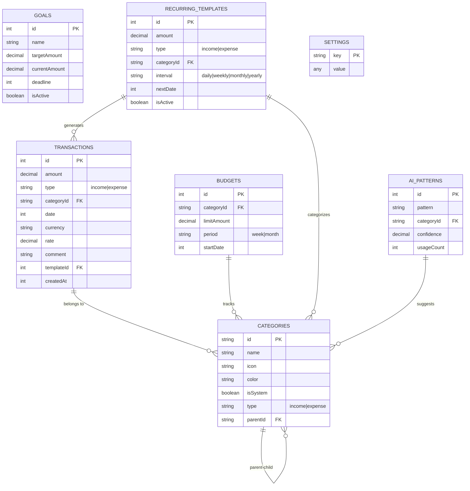

# Database Schema

Database architecture diagram for Finly PWA application.

## ER Diagram

## Tables Description

| Table | Primary Key | Description |
|-------|-------------|-------------|
| `transactions` | `id` (auto-increment) | Financial transactions (income/expenses) |
| `categories` | `id` (UUID string) | Categories with icons and colors |
| `budgets` | `id` (auto-increment) | Spending limits per category and period |
| `goals` | `id` (auto-increment) | Financial goals / savings targets |
| `recurringTemplates` | `id` (auto-increment) | Templates for recurring payments |
| `settings` | `key` (string) | Key-value store for app settings |
| `aiPatterns` | `id` (auto-increment) | AI patterns for auto-categorization |

## Relationships

- **Transactions → Categories**: Many-to-one (each transaction belongs to a category)
- **Budgets → Categories**: Many-to-one (budgets track limits per category)
- **Recurring Templates → Categories**: Many-to-one (templates define category for payments)
- **AI Patterns → Categories**: Many-to-one (patterns suggest categories)
- **Categories → Categories**: Self-referencing (support for subcategories via `parentId`)
- **Recurring Templates → Transactions**: One-to-many (templates generate transactions)
